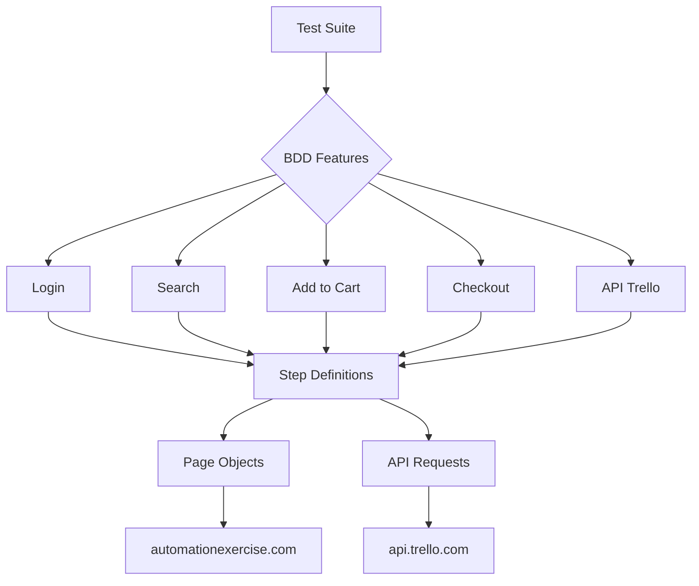

# 🧪 Teste de Automação HCXpert


Projeto de automação de testes para o processo seletivo da **HCXpert**. O projeto cobre testes automatizados **Web** (automationexercise.com) e **API** (Trello), utilizando **Cypress + Cucumber (BDD)** com cenários positivos e negativos.

## 🏗️ Arquitetura do Projeto



---

## 📋 Índice

- [Tecnologias Utilizadas](#-tecnologias-utilizadas)
- [Pré-requisitos](#-pré-requisitos)
- [Instalação e Configuração](#-instalação-e-configuração)
- [Executando os Testes](#-executando-os-testes)
- [Estrutura do Projeto](#-estrutura-do-projeto)
- [Casos de Teste Cobertos](#-casos-de-teste-cobertos)
- [Relatórios de Teste](#-relatórios-de-teste)
- [Integração com JIRA Xray](#-integração-com-jira-xray)

---

## 🛠 Tecnologias Utilizadas

| Tecnologia | Versão | Descrição |
|---|---|---|
| **Node.js** | >= 18 | Runtime JavaScript |
| **Cypress** | 13.x | Framework de testes E2E |
| **Cucumber (BDD)** | 21.x | Pré-processador Cucumber para Cypress |
| **Playwright** | 1.x | Geração de evidências manuais (browser headed) |
| **PowerShell** | 5.1+ | Captura desktop da janela do browser |
| **Webpack** | 5.x | Bundler para step definitions |
| **GitHub Actions** | - | Pipeline de CI/CD |
| **JIRA Xray** | - | Integração com gestão de testes |

---

## ✅ Pré-requisitos

- [Node.js](https://nodejs.org/) versão 18 ou superior
- [npm](https://www.npmjs.com/) (instalado junto com o Node.js)
- [Git](https://git-scm.com/)
- Conexão com a internet (os sites testados são públicos)

---

## 🚀 Instalação e Configuração

1. **Clone o repositório:**

```bash
git clone https://github.com/seu-usuario/hcxpert-automation.git
cd hcxpert-automation
```

2. **Instale as dependências:**

```bash
npm install
```

---

## ▶️ Executando os Testes

### Executar testes (modo headless)

```bash
npm test
```

### Executar testes com evidências manuais (browser + captura desktop)

```bash
npm run test:headed
```

Gera 30 screenshots do browser inteiro (1296×788) via Playwright + PowerShell.

### Abrir o Cypress (modo interativo)

```bash
npm run test:open
```

### Executar em navegador específico

```bash
npm run test:chrome
```

### Executar testes de um arquivo específico

```bash
npx cypress run --spec "cypress/e2e/features/login.feature"
npx cypress run --spec "cypress/e2e/features/api_trello.feature"
```

### Executar testes e enviar resultados para o JIRA Xray

```bash
npm run test:xray
```

> **Pré-requisito:** Configurar as credenciais no arquivo `.env` (veja [Integração com JIRA Xray](#-integração-com-jira-xray)).

---

## 📁 Estrutura do Projeto

```
hcxpert-automation/
├── cypress/
│   ├── e2e/
│   │   ├── features/               # Arquivos .feature (BDD)
│   │   │   ├── login.feature
│   │   │   ├── search.feature
│   │   │   ├── add_to_cart.feature
│   │   │   ├── checkout.feature
│   │   │   └── api_trello.feature
│   │   └── step_definitions/        # Step definitions (Cucumber)
│   │       ├── loginSteps.js
│   │       ├── searchSteps.js
│   │       ├── cartSteps.js
│   │       └── apiSteps.js
│   ├── evidencias/                  # Screenshots manuais (browser inteiro)
│   │   ├── add_to_cart.feature/
│   │   ├── login.feature/
│   │   ├── search.feature/
│   │   ├── checkout.feature/
│   │   └── api_trello.feature/
│   ├── support/
│   │   ├── page_objects/            # Page Object Model
│   │   │   ├── loginPage.js
│   │   │   ├── productsPage.js
│   │   │   ├── cartPage.js
│   │   │   └── homePage.js
│   │   └── e2e.js
│   └── fixtures/
│       └── users.json               # Massa de dados
├── scripts/
│   ├── evidence-manual.mjs          # Gera evidencias manuais (Playwright + PowerShell)
│   ├── capture-chrome-window.ps1    # Captura desktop da janela do browser
│   ├── capture-api-evidencias.mjs   # Evidencias de API via templates HTML
│   ├── generate-report.mjs          # Relatorio HTML Cucumber
│   ├── upload-xray.mjs              # Upload de resultados para JIRA Xray
│   └── templates/
│       ├── api-evidence-01.html
│       └── api-evidence-02.html
├── cypress.config.js                # Configuração do Cypress
├── package.json                     # Dependências
├── .env.example                     # Template de variaveis de ambiente
├── .gitignore
└── README.md
```

---

## 🧾 Casos de Teste Cobertos

### 🔐 Login (`automationexercise.com/login`)

| # | Cenário | Tipo |
|---|---|---|
| 1 | Login com credenciais válidas (`teste2024@teste.com.br` / `teste`) | Positivo |
| 2 | Login com credenciais inválidas | Negativo |

### 🔍 Busca de Produtos (`/products`)

| # | Cenário | Tipo |
|---|---|---|
| 1 | Buscar produto existente ("Blue Top") | Positivo |
| 2 | Buscar produto inexistente | Negativo |

### 🛒 Adicionar ao Carrinho

| # | Cenário | Tipo |
|---|---|---|
| 1 | Adicionar produto ao carrinho estando logado | Positivo |
| 2 | Adicionar produto ao carrinho como visitante | Negativo |

### 💳 Checkout e Finalização

| # | Cenário | Tipo |
|---|---|---|
| 1 | Validar produto no carrinho na tela de pagamento | Positivo |
| 2 | Finalizar compra com produto no carrinho | Positivo |

### 🌐 API Trello

| # | Cenário | Status Esperado |
|---|---|---|
| 1 | GET em ação válida e validação do campo `list.name` | 200 |
| 2 | GET em ação com ID inválido | 400 |

**Total Geral: 10 cenários de teste (8 Web + 2 API)**

---

## 📸 Evidências de Teste

Cada cenário gera **4 screenshots do browser inteiro** (1296×788) seguindo o padrão:

1. **Item visível** — mostra o elemento alvo na tela
2. **Ação** — hover / preenchimento / overlay
3. **Clique com contorno vermelho** — `4px solid red` no elemento antes da ação
4. **Resultado** — estado final após a ação

### Estrutura

```
cypress/evidencias/<spec.feature>/<YYYY-MM-DD>/
├── manual_01_item_visivel.png
├── manual_02_overlay_laranja.png
├── manual_03_adicionado_contorno.png
└── manual_04_item_no_carrinho.png
```

### Como gera

`npm run test:headed` executa em sequência:
1. Cypress headed (validação dos cenários, **zero screenshots**)
2. Playwright Chromium headed + PowerShell captura a janela do browser

### Bloqueio de anúncios

- Rotas de ad networks (`doubleclick.net`, `googlesyndication.com`, etc.) são abortadas no Playwright
- Elementos de anúncio são removidos do DOM antes de cada captura
- Popups indesejados são fechados automaticamente

---

## 📊 Relatórios de Teste

O projeto gera relatórios HTML automaticamente via `@badeball/cypress-cucumber-preprocessor`.

Após executar os testes, o relatório estará disponível em:

```
cypress/reports/cucumber-report.html
```

---

## 🔗 Integração com JIRA Xray

O projeto suporta envio automático dos resultados dos testes para **JIRA Xray** via API.

### Configuração

1. No Jira, vá em **Configurações > APPS > Xray > API Keys** e crie um `client_id` e `client_secret`
2. Copie o arquivo `.env.example` para `.env`:

```bash
cp .env.example .env
```

3. Preencha as credenciais no `.env`:

```env
XRAY_CLIENT_ID=seu_client_id_aqui
XRAY_CLIENT_SECRET=seu_client_secret_aqui
```

### Funcionamento

O script `scripts/upload-xray.js`:

1. Lê o relatório Cucumber JSON gerado em `cypress/reports/cucumber-report.json`
2. Autentica na API do Xray (`/api/v2/authenticate`)
3. Envia os resultados via `POST /api/v2/import/execution/cucumber`

### Executar com upload

```bash
npm run test:xray
```

> **Nota:** O arquivo `.env` está no `.gitignore` e **nunca** deve ser versionado.

---

## 👤 Autor

**Rafael M. Sales**

---

## 📄 Licença

Este projeto está sob a licença MIT.
